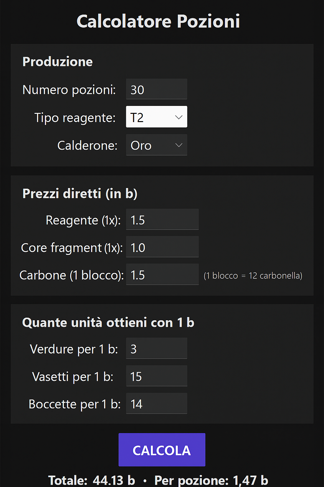

<p align="center">
  
  
  
  
  
</p>

# ⚗️ Elysium Pozioni

Un calcolatore di pozioni con interfaccia grafica (GUI) realizzato in **Python + Tkinter**, pensato per semplificare la gestione dei costi di produzione delle pozioni nel mondo di **Elysium**.

---

## 🧪 Funzionalità principali

- Calcola automaticamente:
  - 💰 Costo totale e costo per singola pozione  
  - ⚗️ Quantità di reagenti, core fragment, resine, carbonella e boccette richiesti  
- Supporta due tipi di calderoni:
  - 🟡 **Calderone d’Oro** → 2 catalyst = 3 pozioni, 2 carbonella per 3 pozioni  
  - ⚙️ **Calderone di Ferro** → 1 catalyst = 1 pozione, 2 carbonella per 1 pozione  
- Gestione automatica dei prezzi:
  - Prezzi unitari configurabili per reagenti, core, carbone, verdure, vasetti e boccette  
- Interfaccia scura (dark theme) ottimizzata per la leggibilità  
- Scroll intelligente: puoi scorrere la schermata o solo la sezione dei dettagli con la rotellina del mouse  

---

## 📸 Anteprima (dark theme)

<p align="center">
  
</p>


## 🖥️ Requisiti

- **Python 3.10** o superiore  
- Libreria **Tkinter** (inclusa di default in Python)

Puoi verificare la versione di Python installata eseguendo:
```bash
python --version
